  

# 👋 Olá! Eu sou Carlos Joab Pessoa

💻 Estudante de Ciência da Computação  
🔧 Técnico de Telecomunicações  
🚀 Desenvolvedor em formação com foco em Desenvolvimento Full Stack  

---

## 🧠 Sobre mim

Sou estudante de **Ciência da Computação** e atualmente atuo como **Técnico de Telecomunicações**, trabalhando com redes, equipamentos de telecomunicações, ONTs, roteadores, fibra óptica, suporte técnico, manutenção e diagnóstico de problemas.

Paralelamente à minha experiência profissional, venho construindo minha carreira em **Desenvolvimento de Software**, por meio de projetos acadêmicos e pessoais.

Tenho interesse principalmente no desenvolvimento de aplicações **Full Stack**, buscando aprender continuamente e transformar problemas em soluções através da tecnologia.

---

## 🚀 Tecnologias e conhecimentos

### 💻 Desenvolvimento

- Java
- JavaScript
- Python
- HTML
- CSS
- React

### 📱 Desenvolvimento Mobile

- React Native
- Expo
- Flutter
- Dart

### 🗄️ Banco de Dados

- SQL
- MySQL
- SQLite
- Oracle SQL

### ⚙️ Ferramentas

- Git
- GitHub
- Visual Studio Code

---

## 🔧 Experiência em Tecnologia

Além do desenvolvimento de software, também possuo experiência profissional com:

- 🌐 Redes e conectividade
- 📡 Telecomunicações
- 🔌 Configuração de ONTs e roteadores
- 🧵 Fibra óptica
- 🛠️ Manutenção e configuração de equipamentos
- 🖥️ Suporte técnico
- 📹 Sistemas de monitoramento e câmeras
- 🔎 Diagnóstico e resolução de problemas

---

## 📂 Projetos

### 🎮 Jogo da Forca

Projeto desenvolvido como parte do meu aprendizado em programação e desenvolvimento de aplicações.

Tecnologias utilizadas durante o desenvolvimento:

- Java
- Flutter
- Dart
- SQLite

🔗 *Projeto disponível no meu GitHub.*

---

### 📱 MakeIt App

Projeto acadêmico voltado para organização de rotinas.

Tecnologias e ferramentas utilizadas:

- React Native
- Expo
- Figma

🔗 *Projeto em desenvolvimento.*

---

## 🎯 Atualmente

Atualmente estou focado em:

- 📚 Evoluir meus conhecimentos em Desenvolvimento de Software
- 💻 Criar projetos para fortalecer meu portfólio
- 🌐 Aprimorar conhecimentos em desenvolvimento Web
- ⚙️ Evoluir em Back-end e Banco de Dados
- 🚀 Construir aplicações cada vez mais completas
- 👨‍💻 Buscar oportunidades de estágio e posições de entrada na área de Desenvolvimento de Software

---

## 🎯 Objetivo

Meu objetivo é iniciar e desenvolver minha carreira profissional como **Desenvolvedor de Software**, com foco inicial em **Desenvolvimento Full Stack e Back-end**.

Quero continuar construindo projetos práticos, adquirindo experiência e evoluindo constantemente como profissional.

Também tenho interesse pela área de **Dados**, que considero uma possível direção de especialização ao longo da minha carreira.

---

## 📫 Contato

📧 **Email:** carlosjoab13@gmail.com  

💼 **LinkedIn:**  
[linkedin.com/in/joab-pessoa](https://www.linkedin.com/in/joab-pessoa)

---

⭐ Obrigado por visitar meu perfil!
